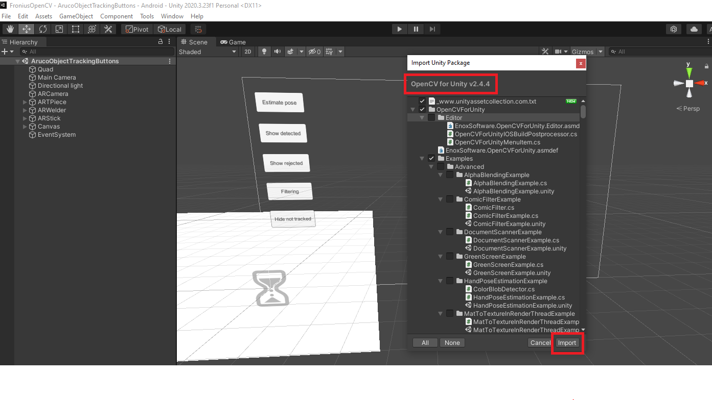
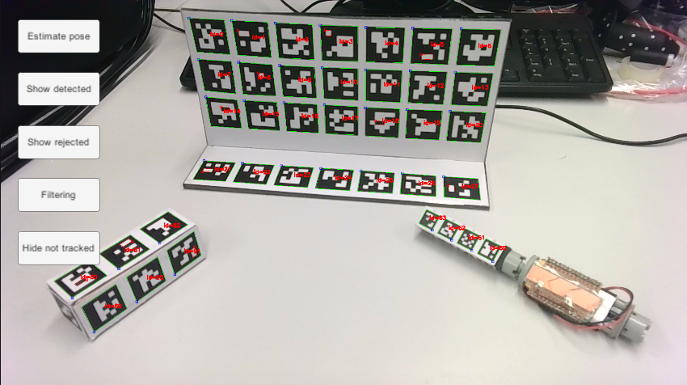
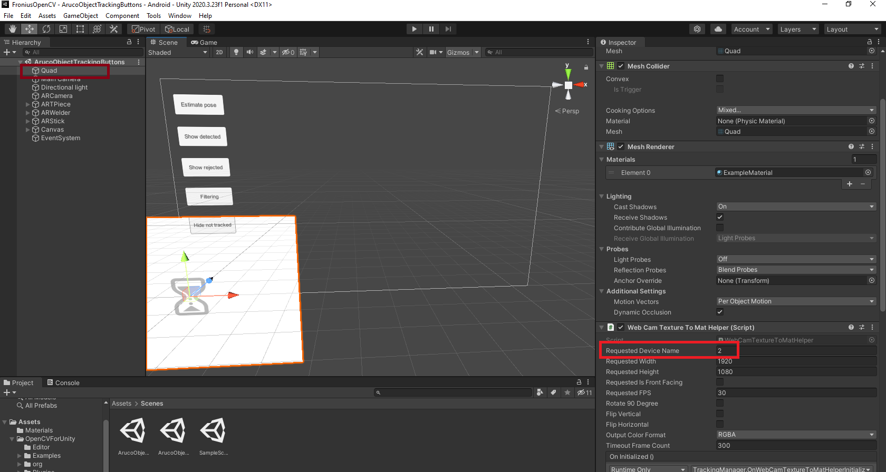
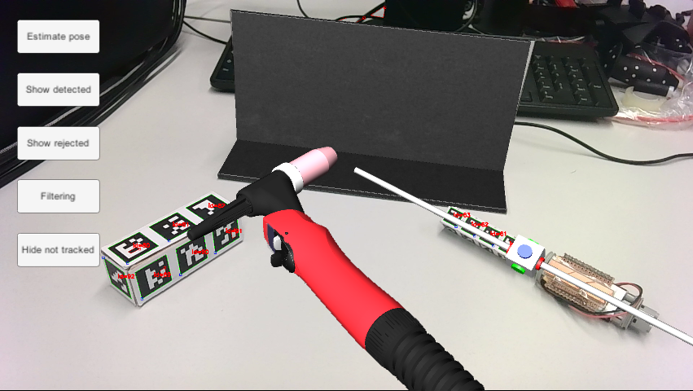

# FNS Aruco Tracking

This repository contains Unity example of detecting aruco markers with OpenCV.

**Table of Contents**

- [FNS Aruco Tracking](#fns-aruco-tracking)
  * [Getting Started](#getting-started)
    + [Prerequisites](#prerequisites)
    + [Installation](#installation)
  * [Contact](#contact)
    

## Getting Started

Follow this steps to set up your working environment.

### Prerequisites


* [Unity 2020.3.23f](https://unity3d.com/de/get-unity/download)
* [OpenCV for Unity v2.4.4](https://assetstore.unity.com/packages/tools/integration/opencv-for-unity-21088)
* [Github](https://desktop.github.com/) (optional)

### Installation

1. Install Unity

2. Copy files from this repository to your project Assets folder

3. Download and import OpenCV for Unity Plugin


4. Print markers from ```Images/Markers.pdf``` file and fix them to the real objects.


5. Open ```ArucoObjectTrackingButtons``` scene and select your webcam (default 0)


6. Press play



## Contact

Primoz Flander: [primoz.flander@gmail.com](<mailto:primoz.flander@gmail.com>)

Project Link: [FNS Aruco Tracking](https://github.com/primozflander/fns_aruco_tracking)